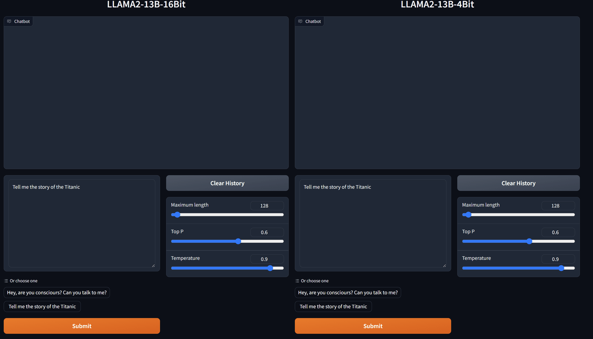

# BitBLAS

BitBLAS is a library to support mixed-precision BLAS operations on GPUs, for example, the $W_{wdtype}A_{adtype}$ mixed-precision matrix multiplication where $C_{cdtype}[M, N] = A_{adtype}[M, K] \times W_{wdtype}[N, K]$.
BitBLAS aims to support efficient mixed-precision DNN model deployment, especially the $W_{wdtype}A_{adtype}$ quantization in large language models (LLMs), for example, the $W_{UINT4}A_{FP16}$ in [GPTQ](https://arxiv.org/abs/2210.17323), the $W_{INT2}A_{FP16}$ in [BitDistiller](https://arxiv.org/abs/2402.10631), the $W_{INT2}A_{INT8}$ in [BitNet-b1.58](https://arxiv.org/abs/2402.17764). BitBLAS is based on techniques from our accepted submission at OSDI'24.


Some of the key features of BitBLAS include:
  - High performance matrix multiplication for both GEMV (e.g., the single batch auto-regressive decode phase in LLM) and GEMM (e.g., the batched auto-regressive decode phase and the prefill phase in LLM):
    - $W_{wdtype}A_{adtype}$ mixed-precision matrix multiplication including FP16xINT4/2/1, INT8xINT4/2/1, etc. Please checkout [support matrix](#support-matrix) for detailed data types support.
    - Matrix multiplication like FP16xFP16 and INT8xINT8.
  - Auto-Tensorization for TensorCore-like hardware instructions.
  - Implemented [integration](/integration/) to [PyTorch](https://pytorch.org/), [AutoGPTQ](https://github.com/AutoGPTQ/AutoGPTQ), [vLLM](https://github.com/vllm-project/vllm) and [BitNet-b1.58](https://huggingface.co/1bitLLM/bitnet_b1_58-3B) for LLM deployment. Please checkout [benchmark summary](#benchmark-summary) for detailed end2end LLM inference performance.
  - BitBLAS first implemented $W_{INT2}A_{INT8}$ GEMV/GEMM in [BitNet-b1.58](https://arxiv.org/abs/2402.17764) with 8x/2x speedup over cuBLAS $W_{FP16}A_{FP16}$ on A100, please checkout [op_benchmark_a100_int2_scaling](images/figures/op_benchmark_a100_int2_scaling.png) for detailed benchmark results. Please checkout [BitNet-b1.58 integration](./integration/BitNet) for the integration with the 3rdparty reproduced BitNet-b1.58 model.
  - Support customizing mixed-precision DNN operations for your specific scenarios via the flexible DSL (TIR Script).

## Integration Example of FasterTransformer with BitBLAS



## Benchmark Summary

BitBLAS achieves exceptional performance across a variety of computational patterns. Below are selected results showcasing its capabilities:

- End2End Integration with Quantize Inference Kernel for AutoGPTQ and vLLM.

  <div>
    
    
    
    
  </div>

- Weight Only Matmul performance on A100

  <div>
    
    
  </div>


- TensorCore FP16/INT8 GEMM Performance Vs. Vendor Library on A100 and RTX4090

  <div>
    
    
  </div>

For more detailed information on benchmark sets with other formats (NF4/FP4) and other devices (RTX 3090), please refer to the [benchmark](./benchmark/README.md).

## Support Matrix

| **A_dtype** | **W_dtype** | **Accum_dtype** | **Out_dtype** | **BitBLAS<br>Support** | **Tested<br>Platform** |
|:-----------:|:-----------:|:---------------:|:---------------:|:----------------------:|:----------------------:|
|     FP16    |     FP16    |       FP16      |       FP16      |          **√**         |   V100(SM_70)/A100(SM_80)/A6000(SM_86)/RTX 4090(SM_89) |
|     FP16    |   FP4_E2M1  |       FP16      |       FP16      |          **√**         |   V100(SM_70)/A100(SM_80)/A6000(SM_86)/RTX 4090(SM_89) |
|     FP16    |     INT8    |       FP16      |       FP16      |          **√**         |   V100(SM_70)/A100(SM_80)/A6000(SM_86)/RTX 4090(SM_89) |
|     FP16    |     UINT4/INT4    |       FP16      |       FP16      |          **√**         |   V100(SM_70)/A100(SM_80)/A6000(SM_86)/RTX 4090(SM_89) |
|     FP16    |     UINT2/INT2    |       FP16      |       FP16      |          **√**         |   V100(SM_70)/A100(SM_80)/A6000(SM_86)/RTX 4090(SM_89) |
|     FP16    |     UINT1    |       FP16      |       FP16      |          **√**         |   V100(SM_70)/A100(SM_80)/A6000(SM_86)/RTX 4090(SM_89) |
|     FP16    |     NF4     |       FP16      |       FP16      |          **√**         |   V100(SM_70)/A100(SM_80)/A6000(SM_86)/RTX 4090(SM_89) |
|     INT8    |     INT8    |      INT32      |    FP32/INT32/FP16/INT8   |          **√**         |   V100(SM_70)/A100(SM_80)/A6000(SM_86)/RTX 4090(SM_89) |
|     INT8    |     UINT4/INT4    |      INT32      |    FP32/INT32/FP16/INT8   |          **√**         |   V100(SM_70)/A100(SM_80)/A6000(SM_86)/RTX 4090(SM_89) |
|     INT8    |     UINT2/INT2    |      INT32      |    FP32/INT32/FP16/INT8   |          **√**         |   V100(SM_70)/A100(SM_80)/A6000(SM_86)/RTX 4090(SM_89) |
|     INT8    |     UINT1    |      INT32      |    FP32/INT32/FP16/INT8   |          **√**         |   V100(SM_70)/A100(SM_80)/A6000(SM_86)/RTX 4090(SM_89) |

We are continuously expanding the support matrix. If you have any specific requirements, please feel free to open an issue or PR.

## Getting Started

- [Installation](https://github.com/microsoft/BitBLAS/blob/main/docs/Installation.md):
  To install BitBLAS, please checkout the document [installation](https://github.com/microsoft/BitBLAS/blob/main/docs/Installation.md). Also Make sure you already have the cuda toolkit (version >= 11) installed in the system. Or you can easily install from `pip install bitblas` in the root directory. 

- [QuickStart](https://github.com/microsoft/BitBLAS/blob/main/docs/QuickStart.md): BitBLAS provides two Python APIs to perform mixed-precision matrix multiplication:
  - ```bitblas.Matmul``` implements the $W_{wdtype}A_{adtype}$ mixed-precision matrix multiplication of $C_{cdtype}[M, N] = A_{adtype}[M, K] \times W_{wdtype}[N, K]$.
  - ```bitblas.Linear``` is a PyTorch ```nn.Linear```-like module to support a Linear of mixed-precision.

- [Integration](https://github.com/microsoft/BitBLAS/tree/main/integration): Explore how BitBLAS seamlessly integrates with LLM deployment frameworks through our examples. Discover the ease of integrating BitBLAS with PyTorch, AutoGPTQ, and vLLM in the 3rd-party integration examples.

- [Customization](https://github.com/microsoft/BitBLAS/blob/main/docs/ExtendOperatorsWithDSL.md): BitBLAS supports implementing customized mixed-precision DNN operations rather than matrix multiplication with the flexible DSL (TIR Script).


## Contributing

This project welcomes contributions and suggestions. Most contributions require you to agree to a Contributor License Agreement (CLA) declaring that you have the right to, and actually do, grant us the rights to use your contribution. For details, visit https://cla.opensource.microsoft.com.

When you submit a pull request, a CLA bot will automatically determine whether you need to provide a CLA and decorate the PR appropriately (e.g., status check, comment). Simply follow the instructions provided by the bot. You will only need to do this once across all repos using our CLA.

This project has adopted the Microsoft Open Source Code of Conduct. For more information see the Code of Conduct FAQ or contact opencode@microsoft.com with any additional questions or comments.

## Trademarks

This project may contain trademarks or logos for projects, products, or services. Authorized use of Microsoft trademarks or logos is subject to and must follow Microsoft's Trademark & Brand Guidelines. Use of Microsoft trademarks or logos in modified versions of this project must not cause confusion or imply Microsoft sponsorship. Any use of third-party trademarks or logos are subject to those third-party's policies.
