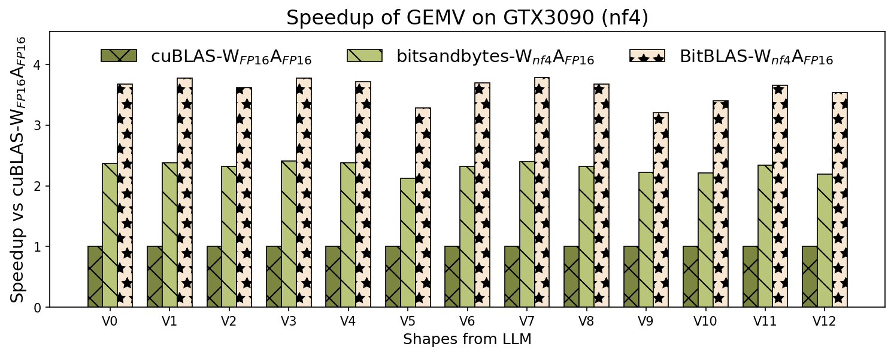
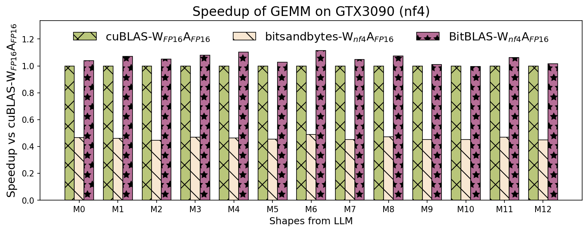
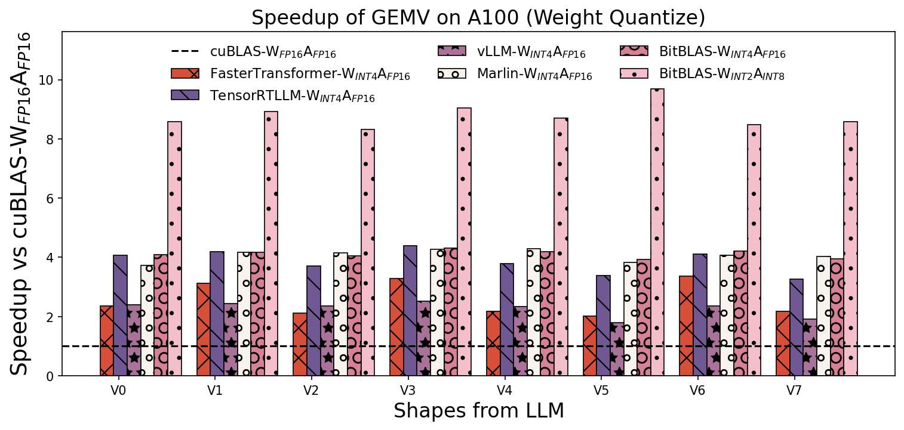
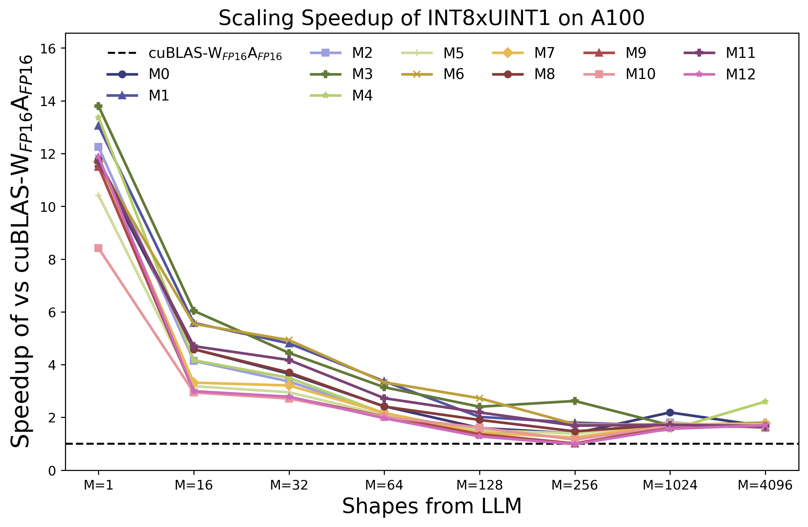

# Speedup Benchmark vs Vendor Libraries

This part presents a benchmark comparison between our custom library, BitBLAS, and various vendor libraries (cuBLAS, CUTLASS, bitsandbytes, faster-transformer, tensorrt-llm, vLLM, and Marlin) across different matrix operation types (GEMM, GEMV) and data formats (float16xfloat16, int8xint8, float16xint4/nf4). The benchmarks are conducted on NVIDIA GPUs - 24GB GTX 3090 and 80GB A100, with CUDA 12.1 installed.

## Benchmark Overview

### Tested Operations and Formats

- GEMM (General Matrix Multiply) and GEMV (General Matrix-Vector Multiply)
- Data formats: float16, int8, float16xint4/nf4

### Hardware

- NVIDIA GTX 3090 (24GB)
- NVIDIA A100 (80GB)

### Software

- CUDA 12.1
- Compared libraries: cuBLAS, CUTLASS, bitsandbytes, faster-transformer, tensorrt-llm, vLLM, Marlin
- Commit ID:
  - bitsandbytes == 0.43.0
  - vLLM: 865732342b4e3b8a4ef38f28a2a5bdb87cf3f970
  - FasterTransformer: 1afbf20129647a35d108152fc6789bc1d029cda5
  - TensorRT-LLM: 2bf3a0a4287069ac55ee3304c285b08592d3d1bc
  - CUTLASS: 629f4653c3ea3db3264030382956fabe715f3436
  - Marlin: 512f1b1ba39ff708bcc95419f11cfd1285cd31b3

## Results Summary

### GTX 3090 Benchmarks

- **Float16 and Int8 GEMM with Tensorcore**: BitBLAS matches the performance of cuBLAS and CUTLASS.
- **Float16xnf4 GEMV and GEMM**: BitBLAS achieves 2x the speed of bitsandbytes and 4x the base float16 performance.
- **Optimal performance** in float16xint4 GEMM.

### A100 Benchmarks

- **Int4 Dequantize Performance**: BitBLAS outperforms bitsandbytes, faster-transformer, tensorrt-llm, vLLM, and Marlin.

## Benchmark Configuration

The benchmark configurations for each test scenario are detailed below:

<!-- center -->

<table class="tableizer-table">
<thead><tr class="tableizer-firstrow"><th>config</th><th>Provider</th><th>M</th><th>N</th><th>K</th></tr></thead><tbody>
 <tr><td>V0</td><td>None</td><td>1</td><td>16384</td><td>16384</td></tr>
 <tr><td>V1</td><td>BLOOM</td><td>1</td><td>43008</td><td>14336</td></tr>
 <tr><td>V2</td><td>BLOOM</td><td>1</td><td>14336</td><td>14336</td></tr>
 <tr><td>V3</td><td>BLOOM</td><td>1</td><td>57344</td><td>14336</td></tr>
 <tr><td>V4</td><td>BLOOM</td><td>1</td><td>14336</td><td>57344</td></tr>
 <tr><td>V5</td><td>OPT</td><td>1</td><td>9216</td><td>9216</td></tr>
 <tr><td>V6</td><td>OPT</td><td>1</td><td>36864</td><td>9216</td></tr>
 <tr><td>V7</td><td>OPT</td><td>1</td><td>9216</td><td>36864</td></tr>
 <tr><td>V8</td><td>LLAMA</td><td>1</td><td>22016</td><td>8192</td></tr>
 <tr><td>V9</td><td>LLAMA</td><td>1</td><td>8192</td><td>22016</td></tr>
 <tr><td>V10</td><td>LLAMA-2</td><td>1</td><td>8192</td><td>8192</td></tr>
 <tr><td>V11</td><td>LLAMA-2</td><td>1</td><td>28672</td><td>8192</td></tr>
 <tr><td>V12</td><td>LLAMA-2</td><td>1</td><td>8192</td><td>28672</td></tr>
 <tr><td>M0</td><td>None</td><td>16384</td><td>16384</td><td>16384</td></tr>
 <tr><td>M1</td><td>BLOOM</td><td>8192</td><td>43008</td><td>14336</td></tr>
 <tr><td>M2</td><td>BLOOM</td><td>8192</td><td>14336</td><td>14336</td></tr>
 <tr><td>M3</td><td>BLOOM</td><td>8192</td><td>57344</td><td>14336</td></tr>
 <tr><td>M4</td><td>BLOOM</td><td>8192</td><td>14336</td><td>57344</td></tr>
 <tr><td>M5</td><td>OPT</td><td>8192</td><td>9216</td><td>9216</td></tr>
 <tr><td>M6</td><td>OPT</td><td>8192</td><td>36864</td><td>9216</td></tr>
 <tr><td>M7</td><td>OPT</td><td>8192</td><td>9216</td><td>36864</td></tr>
 <tr><td>M8</td><td>LLAMA</td><td>8192</td><td>22016</td><td>8192</td></tr>
 <tr><td>M9</td><td>LLAMA</td><td>8192</td><td>8192</td><td>22016</td></tr>
 <tr><td>M10</td><td>LLAMA-2</td><td>8192</td><td>8192</td><td>8192</td></tr>
 <tr><td>M11</td><td>LLAMA-2</td><td>8192</td><td>28672</td><td>8192</td></tr>
 <tr><td>M12</td><td>LLAMA-2</td><td>8192</td><td>8192</td><td>28672</td></tr>
</tbody></table>

**Note:** To reproduce the 3rdparty frameworks' benchmark results, please refer to [mlc-benchmark](https://github.com/LeiWang1999/mlc-benchmark).

## Benchmark Images

BitNET 1.58B INT8xINT2 Matmul BS Scaling on A100.

3090 Related benchmark numbers

A100 Related Benchmark Result

INT8xUINT1 Matmul BS Scaling on A100.

